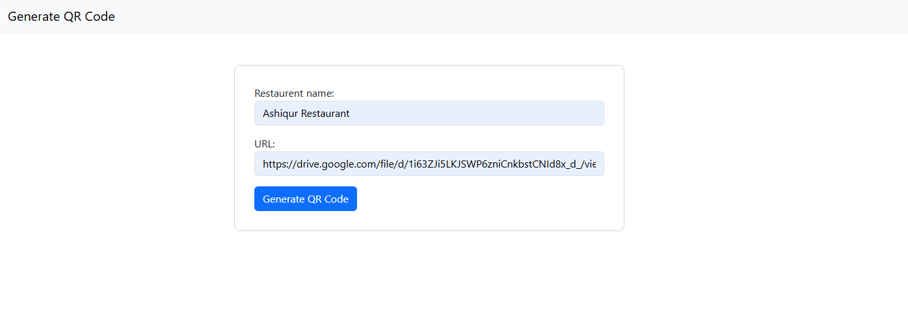
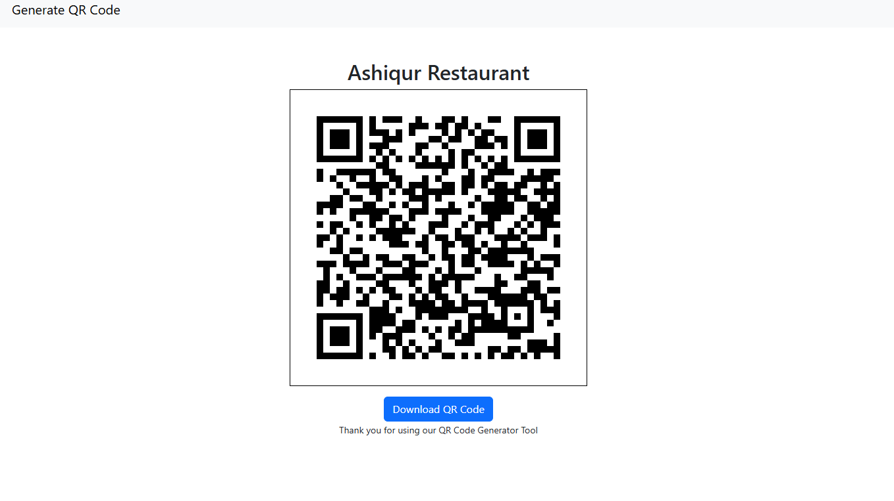

# 🍴 Restaurant Menu QR Code Generator  

A simple **QR Code Generator for Restaurant Menus** built with **Django**.  
Just enter your **restaurant name** and paste a **menu image link** (Google Drive, Dropbox, or any hosted image), and the app will generate a QR code that points to your menu.  

📌 Example Output:  
<p align="center">
  
  
</p>

---

## 🚀 How to Run

### ✅ Option 1: Run with Docker (Recommended)
If you already have Docker installed, you can run the project with **one line**:  

```bash
docker run -p 8000:8000 your-dockerhub-username/django-qr-app:latest
```

Now open 👉 [http://127.0.0.1:8000/](http://127.0.0.1:8000/) in your browser.  

---

### ✅ Option 2: Run Locally (Without Docker)

1. Clone the repository:  
   ```bash
   git clone https://github.com/ashiqdotexe/django_qr_scanner.git
   cd django_qr
   ```

2. Create a virtual environment:  

   **Windows (PowerShell):**
   ```bash
   python -m venv venv
   venv\Scripts\activate
   ```

   **macOS/Linux (bash/zsh):**
   ```bash
   python3 -m venv venv
   source venv/bin/activate
   ```

3. Install dependencies:  
   ```bash
   pip install -r requirements.txt
   ```

4. Run the server:  
   ```bash
   python manage.py runserver
   ```

Now open 👉 [http://127.0.0.1:8000/](http://127.0.0.1:8000/)  

---

## 📷 Features
- Generate **QR codes** for restaurant menus.  
- Upload or link any hosted image (Google Drive, Dropbox, etc.).  
- Easy to run with Docker or locally.  
- Lightweight & simple Django project for learning and practical use.  

---

## 🛠️ Tech Stack
- **Django** (Backend)  
- **qrcode** & **Pillow** (QR generation)  
- **Docker** (Deployment)  

---

## 👨‍💻 Author
Made with ❤️ by [Your Name](https://www.linkedin.com/in/your-linkedin-username)  
